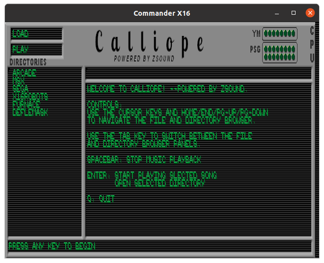

## About Calliope:

Calliope is a player / jukebox application for the Commander X16 for browsing and playing songs in ZSM format. ZSM is the native music format of Zsound, which is freely available to anyone who wants to add audio to their X16 projects. If any other player libraries / formats rise to prevalence with the
X16, Calliope will add support for those as well.

This is version 1.0 of the program which has basic browsing and playback functionality. Future versions will offer the ability to create playlists from the library and cycle through the songs in the list.

Calliope is named after the Greek Muse, not the steampunk player piano, but a steampunk-themed mascot might be cool artwork for the top-of-screen region in future releases. ;)

---
## Using Calliope:

#### Controls:
`Cursor keys` , `Home`/`End`, and `PgUP`/`PgDN` keys navigate the list within
the active screen panel.

`[TAB]` switches between the directory navigator and the file browser panels.

`[ENTER]` enters the selected folder in directory browser 
-or- 
`[ENTER]` starts playing selected song in file browser

`[SPACEBAR]` halts music playback.

`[Q]` quits the program.

*NOTE: The requirement to [TAB] between panels is a bit clunky and will be improved in future releases.*

#### SD Card Image:
If using Calliope in either the official emulator or in Box16, you will need to utilize an SD card image in order to arrange music into folders, as neither supports changing into subdirectories on the host FS as of this release.

---

### Getting Music Files:
This Repo is specifically for the application itself and does not contain any of the music files. You may download a basic collection of songs from this repository:
https://github.com/ZeroByteOrg/vcf22music

The Releases page for Calliope will have zips that include the SD image with the collection from the above archive.

You can create ZSM files from VGMs that use chips understood by the vgm2zsm tool (requires PHP) included with Zsound: https://github.com/ZeroByteOrg/Zsound

You can create music for the X16 VERA PSG chip natively in the Furnace tracker, and export the tune to ZSM format using my fork of the project on the ZSMv1 branch: https://github.com/ZeroByteOrg/Furnace/tree/ZSMv1

---

#### Acknowledgements:
Tremendous thanks to Discord users Jestin#8850 for creating the UI bitmap, and to nicco1690#2556 for creating the nice 4-color font.

Thanks to Furnace community members for contributing music to the archive:
 
* **PacorexTheTrex#0049:**
  * GREENMOTOR.ZSM "Green Motorcycle Guy"
  * INTROSTAGE.ZSM "The Intro Stage"

* **aleksi knutsi#6446:**
  * AHXSTYLE.ZSM
  * IMAGINATION.ZSM "Keys to Imagination"

* **Luna, The Dark Goddess#6136:**
  * LUNADEMO.ZSM

* **MegaSparky#2725:**
  * SPIRALHILLS.ZSM "Hills With Spiral Patterns"

* **Supper_E1#8014:**
  * X16BITPOP.ZSM

* **Natt Akuma**
  * Amiga AHX tracker ZSM export function:
    * CHOPPER.ZSM - "Get To The Chopper" (by Hoffman) on Amiga AHX
